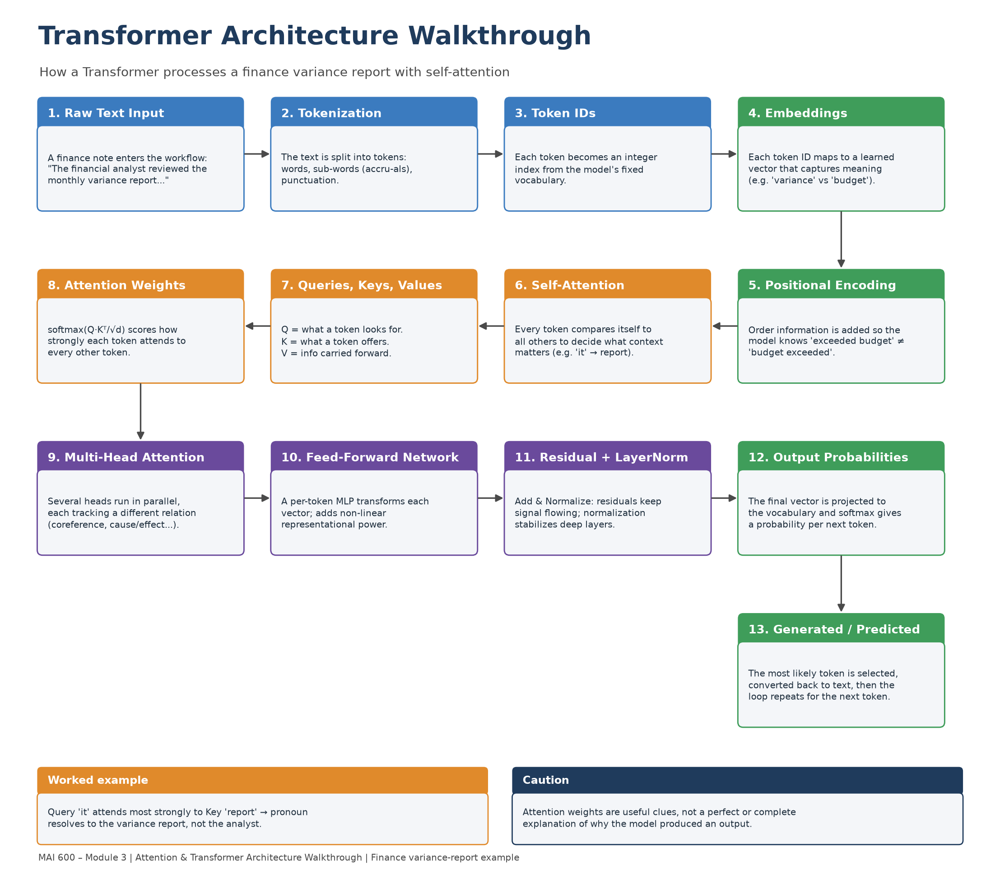

# Module 3 Attention Walkthrough: Finance Variance-Report Example

**Author:** Lais Santos Silva· 
**Course:** MAI 600 – Natural Language Processing· 
**Module 3 – Attention & the Transformer Architecture**

A portfolio project that traces a short **finance operations** paragraph through every stage of a Transformer and shows — by hand *and* with a real pretrained model — how self-attention resolves the relationships in the text.

---

## 1. Problem description

This project explains how a Transformer model uses **self-attention** to process a business/finance note (a month-end *variance report* summary). The goal is **not** to train a model. It is to identify the token relationships in the text and demonstrate how attention, queries/keys/values, multi-head attention, and the surrounding architecture work together to turn words into a context-aware representation.

The notebook runs on two levels:

- **By hand** — a small NumPy example computes one attention step from scratch, so the softmax(QKᵀ/√d)·V math is fully visible.
- **Real model** — `bert-base-uncased` is loaded with `output_attentions=True` to extract and visualize the model's *actual* attention weights on the sentence.

## 2. Dataset / text description

- **Text source:** Original, **fictional** paragraph written for this assignment.
- **Domain:** Business / Finance operations (internal variance-analysis note).
- **Why it was selected:** It is dense with the relationships attention exists to resolve — pronouns (*it*, *they*), two same-word pronouns pointing to *different* entities, a cause/effect chain (unplanned contracts → overspend), a contrast (*but noted… a timing difference rather than a permanent increase*), and domain terms (*variance*, *general ledger*, *accruals*, *cost center*) that trigger interesting sub-word tokenization.
- **No sensitive data:** The paragraph contains no private, confidential, protected, or proprietary information and is safe to publish.

> **The text sample**
>
> *The financial analyst reviewed the monthly variance report because it showed that operating expenses had exceeded the approved budget for the third consecutive quarter. The department manager explained that they had approved several unplanned vendor contracts to cover a seasonal spike in demand, which increased costs beyond the original forecast. The finance team reconciled the general ledger, compared it against the purchase orders, and flagged three invoices that had been recorded under the wrong cost center. After reviewing the accruals, they confirmed that the overspend was genuine but noted that part of it was a timing difference rather than a permanent increase. The controller requested a short summary because the audit committee needed to understand the variance before approving the revised forecast.*

## 3. Attention behaviors found

| # | Behavior | Relationship | Why it matters |
|---|----------|--------------|----------------|
| 1 | **Pronoun resolution** | *it* → **variance report** | *it* must bind to the report, not the analyst, or the finding is misattributed. |
| 2 | **Entity tracking** | 2nd *they* → **finance team** | The two *they*'s refer to different groups (department manager vs. finance team); the model must keep them apart. |
| 3 | **Cause / effect** | *unplanned vendor contracts* → *increased costs* | The overspend is *explained by* the extra contracts — the reason drives the meaning. |
| 4 | **Contrast** | *but noted* → *timing difference rather than a permanent increase* | The contrast reframes the overspend from alarming to partly cosmetic. |

The notebook examines behavior #1 two ways. In the hand-computed toy example, *it* attends most to *report* exactly as the math predicts. In the real model, the *all-head average* is a noisy probe — *it* actually attends most to *showed* (0.096) and *because* (0.073), with *report* only 4th (0.034), because most of the 144 heads attend to `[SEP]`/punctuation rather than doing coreference. The clean signal lives in specific heads: the layer/head scan (Section 5b) finds **Layer 6, Head 10** links *it → report* at **0.816**. The lesson — the average is not the mechanism.

## 4. Transformer diagram

The annotated architecture diagram is [`transformer_diagram.png`](transformer_diagram.png). It labels all required components: raw text input, tokenization, token IDs, embeddings, positional encoding, self-attention, queries/keys/values, attention weights, multi-head attention, feed-forward network, residual connections + layer normalization, output probabilities, and the generated/predicted token.



## 5. Results / observations

- **Pronoun resolution shows up — but only in specific heads.** By hand, *it* attends most to *report*. In the real model the *averaged* attention barely favors *report* (0.034, behind *showed* and *because*), yet a single head — **Layer 6, Head 10** — links *it → report* at **0.816** in the full paragraph. Averaging over 144 heads hides this; only isolating a head surfaces such a strong link.
- **But a strong head is not proof of resolution.** Comparing *"...because it showed an overspend"* (real antecedent) against *"...because it was month end"* (filler *it*), the all-head average is tied (0.052 vs 0.054) **and** the single strongest head (layer 8, head 10) attends *it → report* strongly in **both** — 0.752 for A and even 0.799 for B. The head routes *it → report* out of structural habit, whether or not *it* truly refers to the report. This is the clearest form of *"attention is not explanation."*
- **Same word, different referent is the hard case.** The two *they*'s (department manager vs. finance team) are not always separated cleanly, because both are plausible plural agents; humans lean on world knowledge that attention only partly encodes.
- **Sub-word tokenization is real and matters.** Finance terms such as *accruals* (`acc`,`##ru`,`##als`) and *overspend* (`overs`,`##pen`,`##d`) split into pieces, while *reconciled* and *ledger* stay whole — so domain vocabulary rarely maps one-to-one onto tokens.
- **Order is everything.** Self-attention is order-blind on its own; positional encoding is what separates *"expenses exceeded budget"* from *"budget exceeded expenses."*
- **Attention is a clue, not a proof.** Weights show *where* information was routed, not the full computation (values, feed-forward layers, residual paths, and 144 heads all contribute). Attention maps are evidence to investigate, not final explanations.

## 6. Repository contents

| File | Purpose |
|------|---------|
| [`README.md`](README.md) | This overview. |
| [`attention_walkthrough.ipynb`](attention_walkthrough.ipynb) | The walkthrough: tokenization, hand-computed Q/K/V, real attention heatmaps, behavior tables, sentence comparison, reflection. |
| [`transformer_diagram.png`](transformer_diagram.png) | Annotated Transformer architecture diagram. |
| [`ai_usage_disclosure.md`](ai_usage_disclosure.md) | How AI tools were used and what I verified. |
| `results/` | CSV exports of the token/behavior tables (generated by the notebook). |
| `images/` | Saved attention heatmap (generated by the notebook in Colab). |

## 7. How to run

**Google Colab (recommended):** open `attention_walkthrough.ipynb`, then *Runtime → Run all*. Uncomment the `pip install` line in Section 0 on first run. No GPU needed.

**Locally:**
```bash
python -m venv .venv && source .venv/bin/activate
pip install transformers torch matplotlib pandas numpy
jupyter notebook attention_walkthrough.ipynb
```
Every model cell has a fallback, so the notebook still runs end-to-end (manual analysis only) if the model stack is unavailable.

## 8. AI tool usage

AI tools (Claude / Claude Code) were used as a learning and drafting aid — explaining Q/K/V in plain language, suggesting the diagram layout, scaffolding the notebook, and formatting this README. All concepts, tables, and the reflection were reviewed, verified, and put in my own words. Full details in [`ai_usage_disclosure.md`](ai_usage_disclosure.md).
